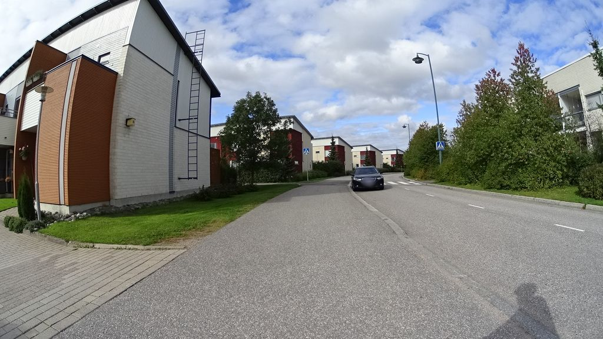
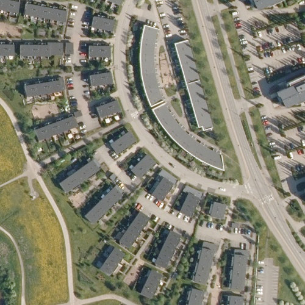
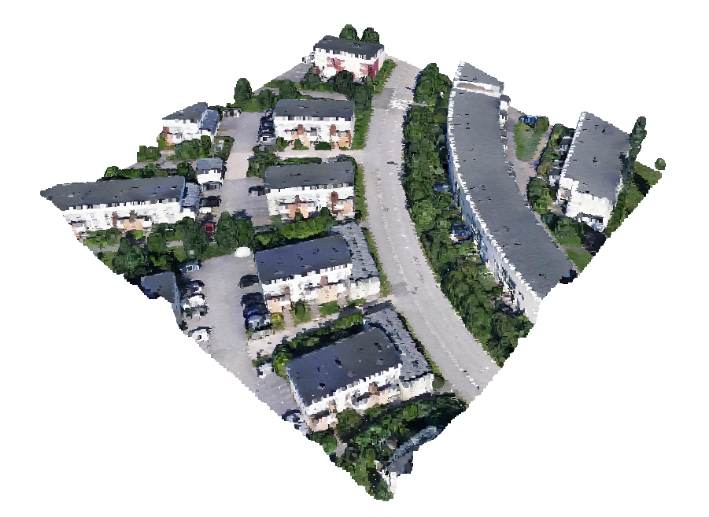
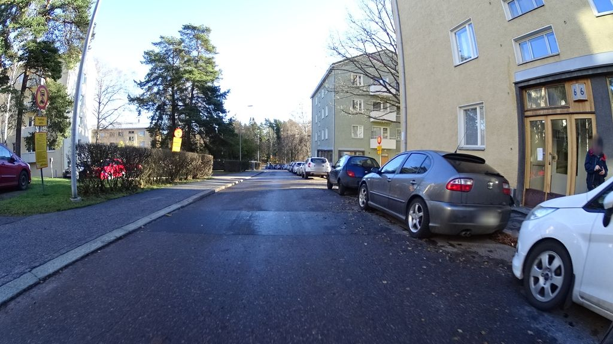
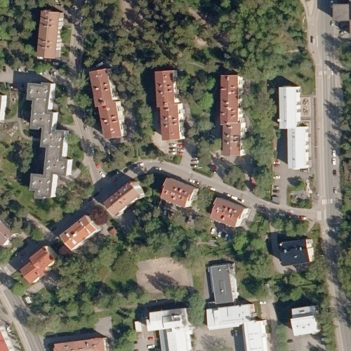
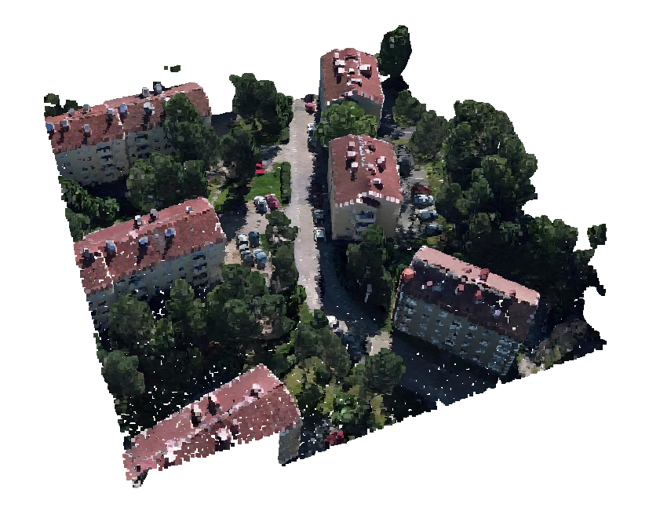
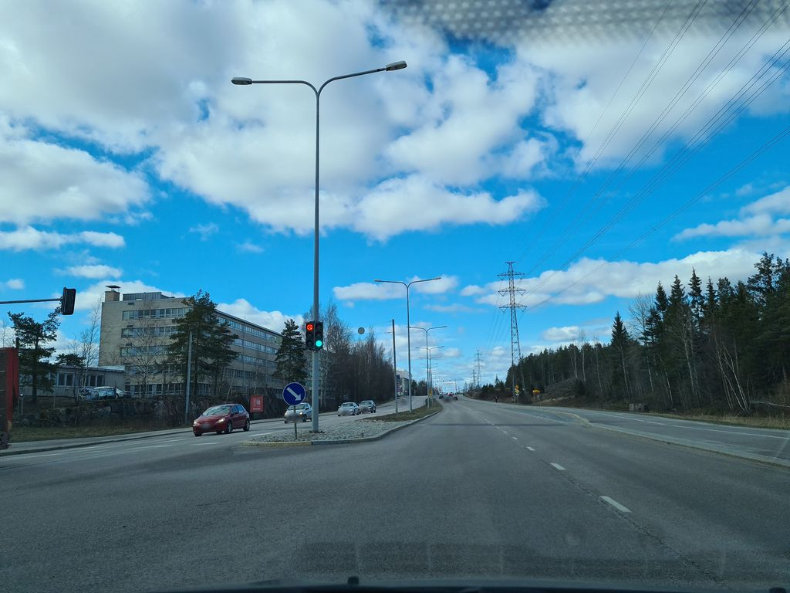
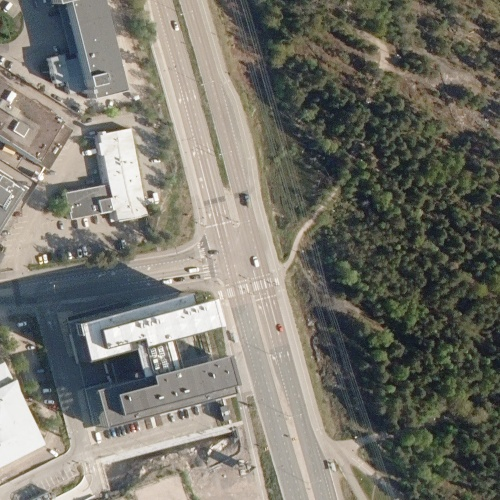
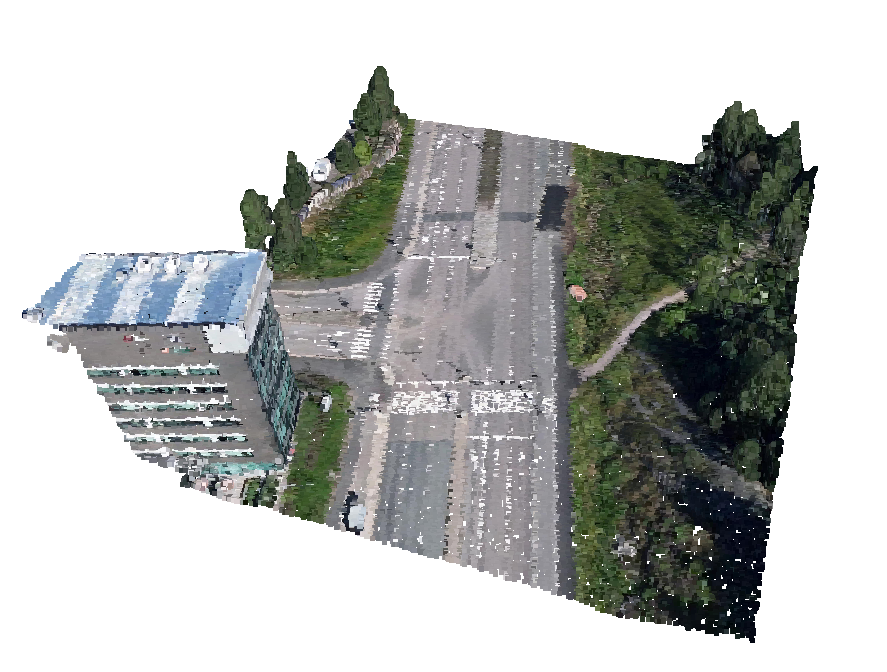

# CVH3D: Cross-View Helsinki 3D Data-Set

This repository provides information about triplets of Ground Image, Aerial Image and 3D Point Cloud from the CVH3D dataset.


| Ground View Image | Aerial View Image | 3D Point Cloud |
|:--:|:--:|:--:|
| | ||
| | ||
| | ||
|Source: Mapillary|Source: National Land Survey of Finland|Source: Helsinki City Municipality|


This repository also contains samples from our dataset CVH3D containing Ground-view, Aerial-view and 3D Point Cloud<br>
- All Ground-view images were downloaded from Mapillary using their API<br>
- Aerial images were downloaded from the database of National Land Survey of Finland.<br> The resolution of the aerial images is 50 cm.<br>
- 3D Mesh samples were downloaded from Helsinki City Municipality website.<br>
- The data above in its unprocessed form is available to the public from the below sources. <br> The data samples shared are licensed under their respective publishers.<br>

**NOTE:** Aerial images were cropped in 200m x 200m (Wider Coverage) squares.<br>3D Point Cloud samples were cropped in 100m x 100m (Detailed Coverage) cubes.

Data sources and licence:
- Ground Image Source: Mapillary: https://www.mapillary.com (licensed under CC-BY-SA)<br>
- Aerial Image Source: National Land Survey of Finland: https://www.maanmittauslaitos.fi/en/maps-and-spatial-data/datasets-and-interfaces/product-descriptions/orthophotos (licensed under CC-BY-4.0)<br>
- 3d Data Source: Helsinki City Municipality (City of Helsinki): https://www.hel.fi/en/decision-making/information-on-helsinki/maps-and-geospatial-data/helsinki-3d (licensed under CC-BY-4.0)<br>

**License:** The data are licensed under the original licenses from their publishers. The above list contains licenses that were stated on the platforms' websites on April 15, 2025.

**Reproducibility:** The data are hosted by Mapillary, Aerial images hosted by National Land Survey of Finland and 3D Mesh data provided by Helsinki City Municipality, and are subject to changes from these platforms. Users on Mapillary can remove their images from the service, and publishers of other data can update/change the data if they choose to do so.

Below we describe the necessary steps to download and pre-preprocess Ground images, Aerial images and 3D Point Cloud.

## Installation
1. Clone this repository:
```bash
git clone https://github.com/nec-research-labs/CVH3D-Dataset
cd CVH3D-Dataset
```
2. Install all dependencies:
```bash
pip install -r requirements.txt
```

## Dataset Structure
Please make sure the folder structure looks like below before starting to download and pre-process.
```text
CVH3D/
  └── ground_images
    └── images
      ├── <image_id>.jpg
      ├── ...
  └── aerial_images
    └── aerial_matrices
      ├── <aerial_id>.npy
      ├── ...
    └── aerial_pngs
      ├── <aerial_id>.png
      ├── ...
    └── raw_images
      ├── <aerial_id>.jp2
      ├── ...
    └── sat_images
      ├── <aerial_id>.png
      ├── ...
  └── 3d_point_cloud
    └── 3d_samples
      └── <block_id>
        └── <sub_block_id>
          ├── <grd_img_id>_pcd_<crop_size>m.hdf5
          ├── ...
    └── converted_pcd
      └── <block_id>
        └── <sub_block_id>
          ├── <sub_block_id>_pcd.ply
          ├── ...
    └── merged_texture_mesh
      └── <block_id>
        └── <sub_block_id>
          ├── <sub_block_id>_merged_mesh.obj
          ├── ...
    └── raw_texture_mesh
      └── <block_id>
        └── <sub_block_id>
          ├── Tile_+<num>_+<num>_L21_<num>.mtl
          ├── Tile_+<num>_+<num>_L21_<num>.obj
          ├── Tile_+<num>_+<num>_L21_<num>_0.jpg
          ├── ...
```

## 1. Download and Pre-process Ground Images:
1. [Create an account on Mapillary and get an access token.](https://www.mapillary.com/developer)
2. Download the ground images using [download_mapillary.py](ground_images/download_mapillary.py) by running the below commands.
```bash
cd ground_images
python download_mapillary.py --path PATH_TO_DOWNLOAD_FOLDER --token "MAPILLARY_ACCESS_TOKEN" --img_size 1024 --workers 0
```
Regarding the arguments:
   - The images by default are downloaded in 1024 size. The other options for ```--img_size``` are: 256, 1024, 2048
   - The code downloads multiple images simultaneously. By default the ```--worker``` argument takes value ```0``` which indicates to use half the number of CPUs available on the system. Any value >0 can be passed to use specific number of CPUs.

## 2. Download and Pre-process Aerial Images:
1. The aerial images can be downloaded manually from the [orthophoto viewer webpage of the National Land Survey of Finland.](https://asiointi.maanmittauslaitos.fi/karttapaikka/tiedostopalvelu/ortoilmakuva?lang=en) Meta information about the Orthophotos is available [here.](https://www.maanmittauslaitos.fi/en/maps-and-spatial-data/datasets-and-interfaces/product-descriptions/orthophotos) The aerial images used for CVH3D data-set for Helsinki region are from the year 2020. Check [this json file](aerial_images/CVH3D_sat_ids.json) for the list of aerial images to be downloded.
2. Place all the downloaded images in [this folder](aerial_images/raw_images) according to the folder structure mentioned above.
3. Pre-process the aerial images using [aerial_imgs_preprocess.py](aerial_images/aerial_imgs_preprocess.py) by running the below commands.
```bash
cd aerial_images
python aerial_imgs_preprocess.py --path PATH_TO_AERIAL_IMAGE_FOLDER --sat_size 400 --precision 4 
```
Regarding the arguments:
   - Aerial image crop size by default is 400x400 pixels. Pass the desired size with ```--sat_size``` argument.
   - ```--precision``` argument specifies GPS decimal precision for searching aerial pair within a satellite image.

## 3. Download and Pre-process 3D Point Cloud:
1. The 3D mesh raw data can be downloaded manually from the [official Helsinki 3D data repository.](https://kartta.hel.fi/?setlanguage=en&e=25498797&n=6677912&r=32&w=*&l=Karttasarja%2Ckaupunkitietomalli_3d_kolmioverkko_mesh_2017&o=100%2C100&swtab=kaikki) Details about the data are mentioned [here.](https://hri.fi/data/en_GB/dataset/helsingin-3d-kaupunkimalli) Index map with 3D data layout is available [here.](https://www.hel.fi/hel2/tietokeskus/data/helsinki/kaupunginkanslia/3D-malli/Helsinki_Mesh_2017_IndexMap.pdf) Check [this json file](3d_point_cloud/meta_data/CVH3D_train_set_3d_blocks.json) for train-set and [this json file](3d_point_cloud/meta_data/CVH3D_validation_set_3d_blocks.json) for validation-set to get the list of mesh blocks and sub-blocks to be downloded.
2. The raw mesh data contains **.obj** files of different **LODs**. CVH3D data-set was created using the highest LOD available i.e. L21. For all the blocks and sub-blocks select all **\*_L21\*** files and place them in [this folder](3d_point_cloud/raw_texture_mesh) according to the folder structure mentioned above.
3. Pre-process the raw mesh to get 3D Point Clouds for each sample using [point_cloud_preprocess.py](3d_point_cloud/point_cloud_preprocess.py) by running the below commands.
```bash
cd 3d_point_cloud
python point_cloud_preprocess.py --path PATH_TO_3D_POINT_CLOUD_FOLDER --sampling_count 1000000 --seed 42 --crop_size 100
```
Regarding the arguments:
   - ```--sampling_count``` argumnet takes the number of points to samples from 3D mesh to create point cloud. By default the values is ```1000000```.
   - 3D point cloud crop size by default is 100x100 meters. Pass the desired size with ```--crop_size``` argument.

To visualize 3D mesh or 3D point cloud use [point_cloud_visualize.py](3d_point_cloud/point_cloud_visualize.py), usage example is below.
```bash
cd 3d_point_cloud
python point_cloud_visualize.py --path PATH_TO_SAMPLE
```

## Issue
Please feel free to raise an issue if you have trouble downloading or pre-processing the data.
 
